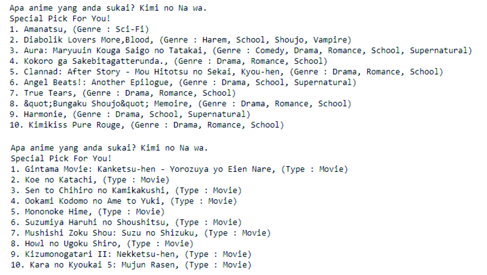

# Anime Recommendation

## Project Overview
The project aims to find recommended anime by content based filtering. I am handling missing values, performing cosine similarity and showing top 10 anime recommendation. Recommended animation based on attribute similarity of preferred animation name input.

## Framework Steps
1. Data Preparation
2. Data Cleaning
3. Feature Engineering
4. Cosine Similarity

